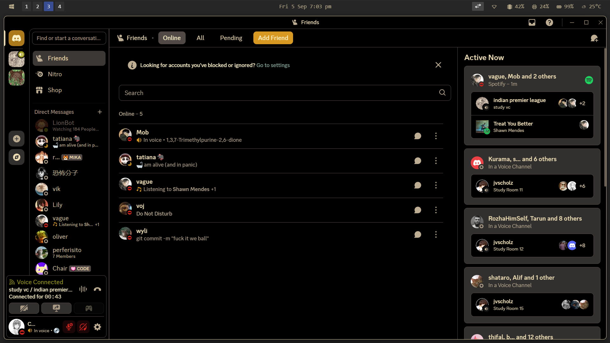
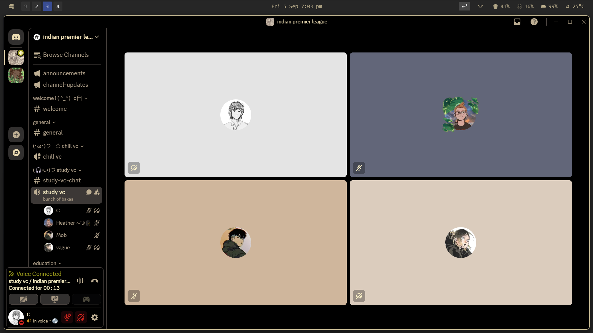

# Dark Gruvbox Theme for Discord

This is an altered CSS version of the Gruvbox Dark theme by *shvedes*. Changes have been made to make it solid black.  

---

## Screenshots
## Home View

## VC View

  
  

## Installation

1. Copy or place `dark-gruvbox-theme.css` into your Discord theme folder (or wherever you manage CSS themes).  
2. Enable Custom CSS / Themes in your Discord client (if applicable).  
3. Activate the theme through Discord themes settings.

This themes works after installing vencord for discord
---

## Credits

- Original Gruvbox Dark Theme by *shvedes*  
- Modified by *arkeeo*
